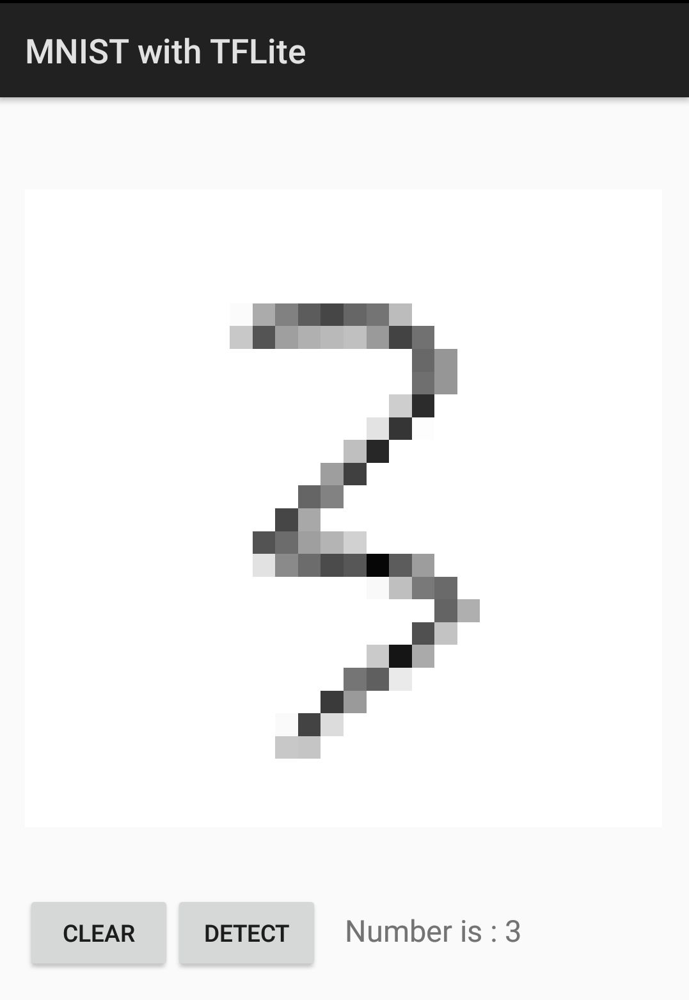

# Android MNIST With TFLite

UI逻辑来源于[MindOrks](https://github.com/MindorksOpenSource)的[AndroidTensorFlowMNISTExample](https://github.com/MindorksOpenSource/AndroidTensorFlowMNISTExample)

训练模型来源于TensorFlow的[basic_classification](https://www.tensorflow.org/tutorials/keras/basic_classification)示例，使用TensorFlow Keras API。

为了能够更好的在Android手机上呈现并供用户测试，训练模型里使用MNIST，而非basic classification示例里的Fashion MNIST。

目前**识别率还有点问题**，需要继续调查下模型是不是哪里有问题，等fix后再上传模型训练相关内容。

核心代码就是以下一小段：

```java
Interpreter mInterpreter = new Interpreter(loadModelFile(mContext));
float[][] labelProbArray = new float[1][10];
mInterpreter.run(userInputPixels, labelProbArray);
return getMax(labelProbArray[0]);
```

最终呈现结果如下：

